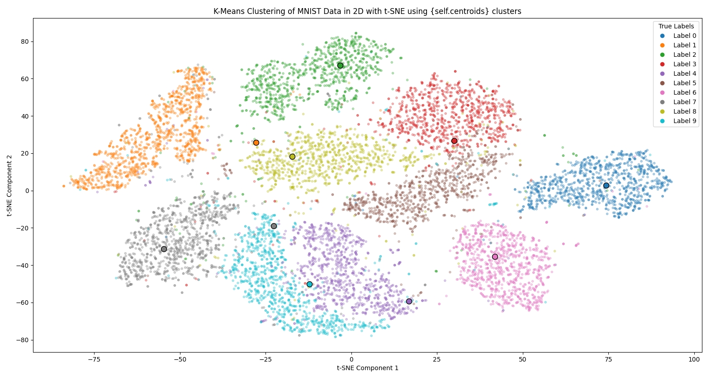
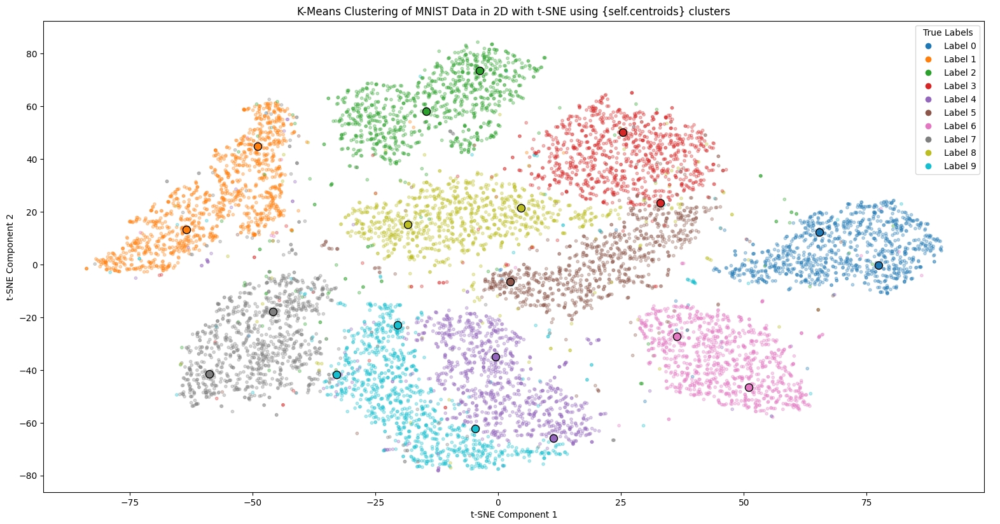
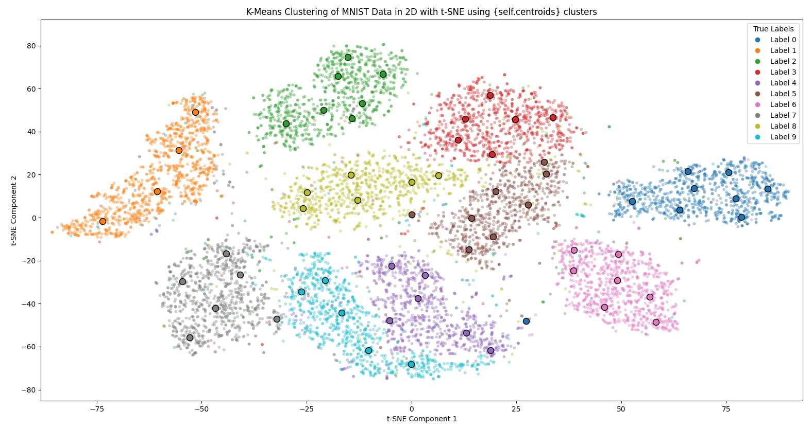
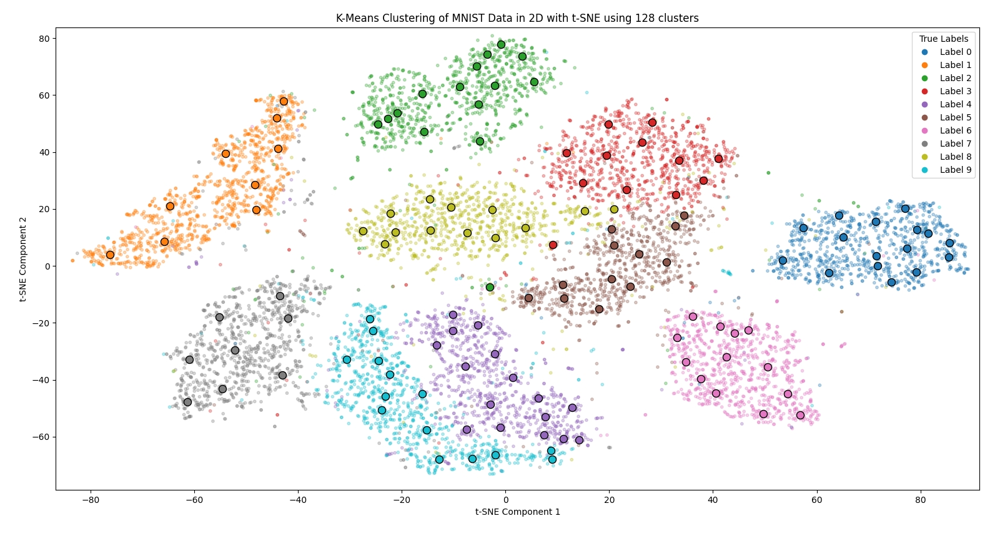

# Lab2

罗绍玮 2022010749

## 实现 K-Means Classifier

首先是实现了一个 K-Means Classifier 的类:

其中比较重要的函数有:

- `initialize_centroids(self, images)`

  使用输入的 `data(images)` 中随机选择 `n_clusters` 个样本作为 `centroids` 的初始值, 并返回一个 `n_clusters*features_size` 的 `np.ndaary`.

- `assign_clusters(self, images)`

  对于输入的每一个 `data(images)`, 为其分配最近的 `centroids`. 返回一个 `len(images)*1` 的`np.ndaary`.

- `update_centroids(self, images, clusters_labels)`

  对于每个当前的 `centroid`, $c_i$ , 跑到"被划分到 $c_i$的所有`data(images)`"的中心(计算 mean)去. 返回更新后的一个 `n_clusters*1` 新质心的 `np.ndaary`.

- `train(self, mnist_data, model_path, load_from_path)`

  使用 `mnist_data` 去对模型进行训练. 可以使用 `model_path` 和 `load_from_path` 指定加载/保存模型参数到目标地方.

  其主要过程是: 

  - Initialize centroids
  - do until convergence or max_iters:
    - Assign clusters
    - Update centroids
  - Assign labels to clusters based on the most frequent label in each cluster

  前面三步主要是用 `mnist_data.images `透过调用上三个函数实现, 最后的 Assign label 则是使用 `mnist_data.labels`, 对每一个 `cluster`, $c_i$ , 统计"被划分到 $c_i$的所有`labels`", 并且取出现次数最多的 label 作为被划分该 `cluster` 的预测 label.

- `predict(self, image)`

  把 `image` 展平, 对每个 `centroid` 进行一次欧氏距离计算, 取出距离最短的那个 `cluster`, 然后返回该 `cluster` 的预测 label.

- `visualize_clusters(self, data, n_components, alg)`

  `data` 是需要可视化的数据; `n_components` 是需要的可视化维度, 可选 {2, 3}; `alg` 是降维的算法, 可选 {"PCA", "TSNE"}.

  `data` 在图中的颜色代表了其真实 label 应为什么, 而 `centroids` 会以加粗实心有黑边的圆点给出, 颜色一样代表了 label.
  
  (注: 使用 TSNE 3 维可视化时, 或许需要等 5 分钟)

## 结果(分析/准确率/可视化)

### n_clusters = 10

最开始我的是用一个最直观的方式去实现的识别器, 那就是使用 10 个 clusters, 分别对应每个 label. 

然而这样做的准确率只有 **61.39%**. 其使用 "2D TSNE" 进行可视化的结果如下:

可以注意到, L5(咖啡色) 的数据没有一个相对应的质心, 而 L7(灰色) 有两个且其中一个还跑到青蓝色去了. 这意味这所有 label 为 5 的预测都必然的错误的, label 为 9 也大概率会被误判成 7. L1(橙色) 的质心也跑到 L8(黄色) 的附近, 8 很可能会被误判为 1.

显然, 这与理想中的 10 个质心分别对应 10 个 label 不太符合. 但这其实也合理. 如果观察训练集中的 8 和 1, 不同人的写法不一样, 且他们两都是一个类似 "竖条" 的东西; 同理 9 和 7 也有这样的问题.

同时, 比如 L5(咖啡) 这样像一个长椭圆的数据分布, 他的质心本来就不好分配. 而且 clustering 算法的目的只是为了让每个 cluster 的占有数据更平均, 当分布长的像椭圆且附近有很多其他数据时, 他很自然会被其他 cluster 纳入而不是被其中一个质心收敛.

### n_clusters = 20

透过上述分析后, 我意识到了对于圆形的分布, 需要更多的 clusters 对其进行分类.

当 n_clusters 增加到 20 时, 测试集的准确率来到了 **70.11%**. 2D TSNE 结果如下

这次的 L1(橙) 和 L7(灰) 的质心分布更加合理了. 然而 L5(咖啡) 的长椭圆分布依旧没很好地被分配, 对应大多数的 label 为 5 的数据, 依旧会存在误判.

### n_clusters = 64

在此基础上, 我把 n_clusters 数量增加到了 128, 获得了 在测试集上 **84.78%** 的准确率. 

然而, cluster 的数量增加使得其训练时间增长. 这是因为在训练过程中需要多次运行的 `assign_clusters` 和 `update_centroids` 这两个函数和 n_cluster 是呈线性关系的.

能看到当前的分类已经有一个非常不错的效果. 但由于依然有着不少不太合理的离群值, 所以准确率上不去.

### n_clusters = 128

最终鉴于训练时间和准确率的衡量, 我选择了 cluster 数量为 128 作为最终结果. 在我的普通笔电上训练了约 3 分钟. 

此时的准确率来到了 **89.32%**. 2D TSNE 结果如下:

## 结论

在实验的过程遇到的困難:

- 首先是数据集的介绍 [Index of /exdb/mnist](http://yann.lecun.com/exdb/mnist/) 不知道为什么变成了空的网站, 导致一开始搞清楚怎么使用数据集花了一点时间.
- 其次是被自己的惯性思维以及不自信给害了一下下. 认为 10 个 clusters 至少也能有个 70% 准确率以上, 因此看到只有 60% 时多次怀疑自己的实现有问题. 
- 最后是可视化我选择了在比较后面的时间去做, 导致了我没能想到把数据分布以及质心放置的关联. 最后就是一开始对 clustering 算法的概念一开始搞错了, 导致实现时出现了一些小 bug.

此外, 实现中能够选择2/3D PCA 作为另一可视化的选择, 其运行速度比 TSNE 快很多. 同时也可以透过 3D TSNE 有一个更好的可视化体验, 但那个要跑个好几分钟, 且不好在报告上说明, 因此只是在实验过程中自己游玩了.

最后, 我还是被 TSNE 的降维方法和结果给震惊到了. 因为我一开始只用了 PCA 并且他的可视化也就那样, 害我还不太知道怎么分析.
